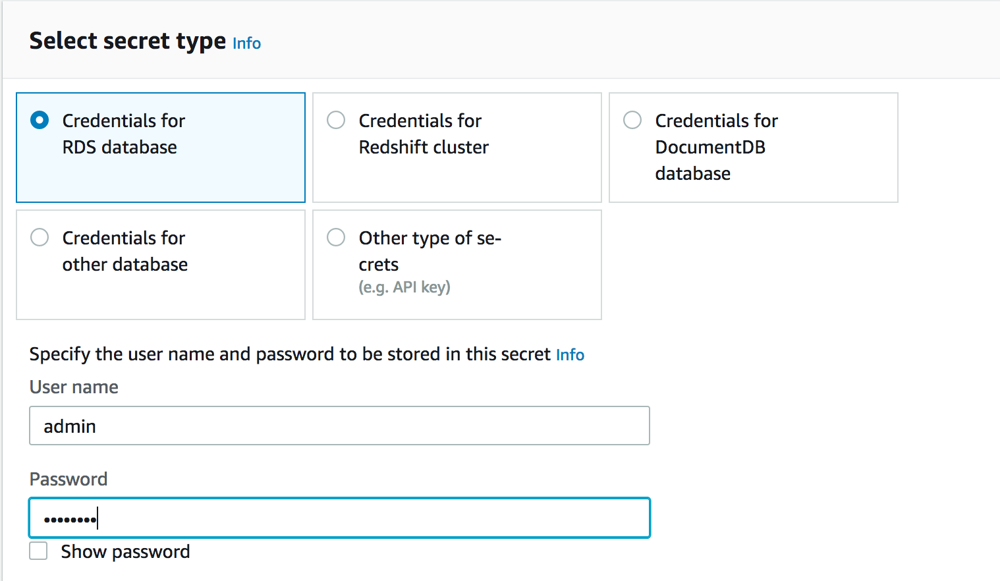

# amazon-rds-proxy-demo

## Introduction
In this demo, you will learn how touse one of the AWS services annouced at reinvent 2019 namely the Amazon RDS Proxy service in order to get a feel of what benefits the service would provide to customers.

## Demo scenario

For this demo, you will use a serverless application powered by AWS lambda which simply acts as a database client that opens many connections on the database and running some queries. You will use a Cloudwatch rule to fire up our lambda function on a defined schedule (every minute) in order to generate load on the database. 

**Demo environment setup**

In this demo you will do the following:

*Part I: Testing with direct DB connection (Before adding the amazon RDS Proxy)*

1. Create a database instance
2. Store the database credentials as secret in AWS Secrets Manager
4. Create a lambda function
5. Create a CloudWatch rule to run our lambda function
6. Allow or CW rule to run the lambda function for few minutes 
7. Check the database monitoring graphs to see the trends for metrics such as DB connections and CPU Utilization
8. Initiate a manual failover 
9. Check the CloudWatch logs for lambda execution and database monitoring graphs to see how long the failover process takes

*Part II: Testing with DB connection via the Amazon RDS Proxy service*

1. Create an IAM role to allow the RDS Proxy to use the database secret created in step 2 of Part I above to connect to the database
2. Create an RDS proxy service
3. Add the RDS Proxy to the database cluster
4. Update our lambda function to replace the DB endpoint with the the RDS proxy endpoint
5. Reapeat steps 6 - 9 of Part I above

**Database creation**

From the AWS console select RDS service and click Create Database. Choose the default options for the creation method, engine options and Edition. For version select the highest version Aurora (MySQL 5.7) 2.07.1 as shown on the screenshot below:

  

Provide a name to your DB cluster and a master username and password.  

Leave everyting else as default and click Create database

Next add a reader instance to your cluster which you are going to use for testing the failover scenario. Select the DB cluster identifier created in the previous step and select Add reader from te Actions menu as shown on the screenshot below:

Add the DB instance identifier for your reader. On the screenshot below the identifier used is rds-auroramysql-demodb-reader

Leave everything else as default and select Add reader to create the reader instance.

Select your DB cluster instance and check that both instances (Writer and Reader) endpoints statuses show Available.

**Storing DB credentials as secret in AWS Secrets Manager**

Next, you will need to store the DB credentials as secret in AWS Secrets Manager. To do this, select Secrets Manager from AWS console and click Store a new secret. Enter your DB username and password and select your RDS database instance that the secret will be used to access. See screenshot below:

Leave the default selection for everything else and click next, provide a name to the secret. You can use the following name rds-auroramysql-demodb-secrets as shown on the screenshot below:

Click next and next again, review your settings and then click store

**Packaging your AWS lambda DB client app**

The code lambda_function.py for the DB client app to be run by AWS lambda can be found in /code folder

Because you use pymsql module which needs to be installed with pip for deployment, you will package your lambda function manually following this [knowledge base article](https://aws.amazon.com/premiumsupport/knowledge-center/build-python-lambda-deployment-package/) 
	
The other file code/rds_config.py is used for storing your DB credentials shown below which you need to import in the lambda function. 

	rds_host  = "<Your-DB-Writer-instance-endpoint>"
	db_username = "<your-DB-username>"
	db_password = "<Your-DB-password>"

Replace the variable in <> above with the corresponding values from your environment.

Please note that it is recommended to use [IAM authentication](https://docs.aws.amazon.com/AmazonRDS/latest/UserGuide/UsingWithRDS.IAMDBAuth.html) instead of DB credentials stored in AWS Secrets manager to eliminate the need to hardcode the DB credentials in your application code.

**Lambda function creation**

Create your lambda function and then deploy it from the package that you created manually in the previous step. To do that go to the AWS lambda console, click on your lambda and select the option Upload a .zip file from the Code entry type drop down menu. 

Now test your newly depoyed function and check in the CloudWatch logs to see the results of your lambda invocation. From the lambda monitoring page, click on View logs in CloudWatch

You should see the results of the queries in the lambda code as shown in the screenshot below:

Run the same queries manually from mysql client.

	[ec2-user@ip-172-31-34-254 ~]$ mysql -u admin -h rds-auroramysql-demodb.cluster-c9di9qmu8xqw.us-east-1.rds.amazonaws.com -p
	Enter password: 
	Welcome to the MariaDB monitor.  Commands end with ; or \g.
	Your MySQL connection id is 880
	Server version: 5.7.12 MySQL Community Server (GPL)
	
	Copyright (c) 2000, 2018, Oracle, MariaDB Corporation Ab and others.
	
	Type 'help;' or '\h' for help. Type '\c' to clear the current input statement.
	
	MySQL [(none)]> use recordstore;
	Reading table information for completion of table and column names
	You can turn off this feature to get a quicker startup with -A
	
	Database changed
	MySQL [recordstore]> SELECT singers.id, singers.name, singers.nationality, records.title \
	    ->                                 FROM singers \
	    ->                                 INNER JOIN records on records.recordid = singers.recordid \
	    ->                                 WHERE records.title LIKE 'Liberian%';
	+-----+-----------------+-------------+---------------+
	| id  | name            | nationality | title         |
	+-----+-----------------+-------------+---------------+
	| 100 | Michael Jackson | American    | Liberian Girl |
	+-----+-----------------+-------------+---------------+
	1 row in set (0.00 sec)
	MySQL [recordstore]> use mysql;
	Reading table information for completion of table and column names
	You can turn off this feature to get a quicker startup with -A
	
	Database changed
	MySQL [mysql]> select * from time_zone limit 1;
	+--------------+------------------+
	| Time_zone_id | Use_leap_seconds |
	+--------------+------------------+
	|            1 | N                |
	+--------------+------------------+
	1 row in set (0.00 sec)
	MySQL [mysql]> use information_schema;
	Reading table information for completion of table and column names
	You can turn off this feature to get a quicker startup with -A
	
	Database changed
	MySQL [information_schema]> select * from ENGINES where transactions = 'YES';
	+--------+---------+------------------------------------------------------------+--------------+------+------------+
	| ENGINE | SUPPORT | COMMENT                                                    | TRANSACTIONS | XA   | SAVEPOINTS |
	+--------+---------+------------------------------------------------------------+--------------+------+------------+
	| InnoDB | DEFAULT | Supports transactions, row-level locking, and foreign keys | YES          | YES  | YES        |
	+--------+---------+------------------------------------------------------------+--------------+------+------------+
	1 row in set (0.00 sec)
	MySQL [information_schema]> use sys;
	Reading table information for completion of table and column names
	You can turn off this feature to get a quicker startup with -A
	
	Database changed
	MySQL [sys]> select * from sys_config limit 1;
	+------------------------------+-------+---------------------+--------+
	| variable                     | value | set_time            | set_by |
	+------------------------------+-------+---------------------+--------+
	| diagnostics.allow_i_s_tables | OFF   | 2017-06-02 00:25:11 | NULL   |
	+------------------------------+-------+---------------------+--------+
	1 row in set (0.00 sec)

As you can from the above output, the results of the queries are exactly the same as the ones captured in CloudWatch logs.

**CloudWatch rule creation**

With your lambda function now deployed, now proceed to creating a CloudWatch rule to trigger your lambda function.

Go to CloudWatch from AWS console, select rule and then click on Create rule. Select Schedule under event source and set a fixed rate of 1 minute. On the right handside select Lambda function and then select your lambda function under the function drop down list. See screenshot below.

Click Configure details to move to the next page, provide a name to your rule and with the State checkbox set to enabled, click Create rule.

**Check database performance**

Now go to RDS console and check the trends under the monitoring tab for our DB instance. You should see from the screenshots below that nearly 2 DB connections have been opened against your RDS Writer instance instance (orange graph). At the same time you can see that the reader instance has received no single DB connection. In terms of CPU utilization,  there are only few peaks due to the increased number of connections. 

While the picture you have here may not indicate a serious issue as it's below 6% CPU usage, in a real production environment things could be different and the impact on the DB performance and the end-users experience would be much greater.

**Failover without Amazon RDS proxy service**

Now try to initiate a manual failover and see how RDS handles it under the current setup. Select one of the instance (Writer or Reader) of the database, and select failover from Actions menu and then click on Failover button on the next page.

You should see from the screenshot below that the two instances have swapped role with rds-auroramysql-demodb-reader promoted to Writer while rds-auroramysql-demodb-instance-1 changing to Reader.

Notice also that there is a slight downtime for write transactions during the failover process as the reader node gets promoted to Writer. You validate this by manually connecting to the DB and running write type query. See SQL client output below:

	MySQL [(none)]> use recordstore;
	No connection. Trying to reconnect...
	Connection id:    3
	Current database: *** NONE ***
	
	Reading table information for completion of table and column names
	You can turn off this feature to get a quicker startup with -A
	
	Database changed
	MySQL [recordstore]> create table demo (id int(11) NOT NULL AUTO_INCREMENT, PRIMARY KEY (id)) AUTO_INCREMENT=1;
	ERROR 1290 (HY000): The MySQL server is running with the --read-only option so it cannot execute this statement
	MySQL [recordstore]> create table demo (id int(11) NOT NULL AUTO_INCREMENT, PRIMARY KEY (id)) AUTO_INCREMENT=1;
	ERROR 1290 (HY000): The MySQL server is running with the --read-only option so it cannot execute this statement
	MySQL [recordstore]> create table demo (id int(11) NOT NULL AUTO_INCREMENT, PRIMARY KEY (id)) AUTO_INCREMENT=1;
	ERROR 1290 (HY000): The MySQL server is running with the --read-only option so it cannot execute this statement
	MySQL [recordstore]> create table demo (id int(11) NOT NULL AUTO_INCREMENT, PRIMARY KEY (id)) AUTO_INCREMENT=1;
	ERROR 1290 (HY000): The MySQL server is running with the --read-only option so it cannot execute this statement

Similarly, you can see from the graphs by going to the monitoring tab a sharp drop in number of connections from 2 to 0 for the old Writer instance and a sharp increase of the new Writer as it starts to accept DB connections.

 

## Adding the RDS Proxy

**Create an IAM role**
 
Create the IAM role for our RDS proxy service. Go to IAM console and select role, add a new role. Follow the iinstructions in [Managing Connections with Amazon RDS Proxy (Preview)](https://docs.aws.amazon.com/AmazonRDS/latest/UserGuide/rds-proxy.html#rds-proxy-iam-setup)

	{
	    "Version": "2012-10-17",
	    "Statement": [
	        {
	            "Sid": "VisualEditor0",
	            "Effect": "Allow",
	            "Action": [
	                "secretsmanager:GetRandomPassword",
	                "secretsmanager:CreateSecret",
	                "secretsmanager:ListSecrets"
	            ],
	            "Resource": "*"
	        },
	        {
	            "Sid": "VisualEditor1",
	            "Effect": "Allow",
	            "Action": "secretsmanager:*",
	            "Resource": [
	                     "your_secret_ARN"
	            ]
	        }
	    ]
	}

Edit the trust policy and add the following:

	{
	  "Version": "2012-10-17",
	  "Statement": [
	    {
	      "Effect": "Allow",
	      "Principal": {
	        "Service": "rds.amazonaws.com"
	      },
	      "Action": "sts:AssumeRole"
	    },
	    {
	      "Sid": "",
	      "Effect": "Allow",
	      "Principal": {
	        "Service": "rds.amazonaws.com"
	      },
	      "Action": "sts:AssumeRole"
	    }
	  ]
	}
	

**RDS proxy creation**

Create an RDS Proxy and attach it to your lambda function so that it connects to the RDS Proxy instead of connecting directly to RDS instance and as such manage the DB connections.

Click on Proxies from RDS page and then on the Create proxy button. Provide an identifier to your proxy. You can call it rds-proxy-demo. Next, select yur Aurora DB cluster from the Database drop down list. Under connectivity, select the secret that you created in Part I. Select the IAM role created in the previous step from the IAM role drop down list. Leave everything else as default and select "I acknowledge this limited service agreement for the RDS Proxy" to agree with the terms of RDS Proxy service. Make a note of the proxy endpoint as you will use it in the next step.

**Testing manually that we can connect to the database using the RDS Proxy endpoint**

Check that you can connect to the database manually using the proxy endpoint.

	[ec2-user@ip-172-31-34-254 ~]$ mysql -u admin -h rds-proxy-demo.proxy-c9di9qmu8xqw.us-east-1.rds.amazonaws.com -p
	Enter password: 
	Welcome to the MariaDB monitor.  Commands end with ; or \g.
	Your MySQL connection id is 780211214
	Server version: 5.7.12 MySQL Community Server (GPL)
	
	Copyright (c) 2000, 2018, Oracle, MariaDB Corporation Ab and others.
	
	Type 'help;' or '\h' for help. Type '\c' to clear the current input statement.
	
	MySQL [(none)]> show databases;
	+--------------------+
	| Database           |
	+--------------------+
	| information_schema |
	| mysql              |
	| performance_schema |
	| recordstore        |
	| sys                |
	+--------------------+
	5 rows in set (0.00 sec)
	
	MySQL [(none)]> 

**Add the Amazon RDS Proxy to your lambda function**

Now add the RDS proxy to your lambda function to have to connect to the Proxy instead of directly to the database.

Go to lambda configuration page and scroll down to the bottom of the page and select Add database proxy. Select the option Choose an existing database proxy and select the proxy created in the previous step. For this demo we use rds-proxy-demo shown on the screenshot below. Next go to the lambda code and change the host endpoint in the database connection string to the RDS Proxy endpoint. At this point you may want to test your lambda function to make sure that it still runs successfully after the change.

Check the RDS proxy service logs in CloudWatch. You can see from the screenshot below that the proxy is receiving client connection and managing DB connections by closing the ones that are idle. 

Now if you look at the RDS instance monitoring, you can see a surge of DB connections as shown in the screenshots below:

**Failover with RDS Proxy**

Without RDS Proxy, a failover involves a brief outage. During the outage, you can't perform write operations on that database. Any existing database connections are disrupted and your application must reopen them. The database becomes available for new connections and write operations when a read-only DB instance is promoted to take the place of the one that's unavailable. Connecting through a proxy makes your application more resilient to database failovers. When the original DB instance becomes unavailable, RDS Proxy connects to the standby database without dropping idle application connections. Doing so helps to speed up and simplify the failover process. The result is faster failover that's less disruptive to your application than a typical reboot or database problem.

You can also validate this by connecting manually to the database via the proxy and run a write-type query such as creating a table.
	
	[ec2-user@ip-172-31-34-254 ~]$ mysql -u admin -h rds-proxy-demo.proxy-c9di9qmu8xqw.us-east-1.rds.amazonaws.com -p
	Enter password: 
	Welcome to the MariaDB monitor.  Commands end with ; or \g.
	Your MySQL connection id is 2048195942
	Server version: 5.7.12 MySQL Community Server (GPL)
	
	Copyright (c) 2000, 2018, Oracle, MariaDB Corporation Ab and others.
	
	Type 'help;' or '\h' for help. Type '\c' to clear the current input statement.
	
	MySQL [(none)]> use recordstore
	Reading table information for completion of table and column names
	You can turn off this feature to get a quicker startup with -A
	
	Database changed
	MySQL [recordstore]> CREATE TABLE IF NOT EXISTS demo (recordid INT PRIMARY KEY, title VARCHAR(255) NOT NULL, release_date DATE);
	Query OK, 0 rows affected (0.02 sec)
	
	MySQL [recordstore]> drop table demo;
	Query OK, 0 rows affected (0.02 sec)

You can see from the screenshot below that with the proxy there is no downtime during the failover process. As the number of DB connections on the Writer drops to 0, the Reader instance that now becomes the new Writer can start receiving connection and perform write transaction.

## Summary
In this demo, you learned how to use Amazon RDS Proxy service by using a small demo application in AWS lambda to connect to an RDS Aurora cluster and run some queries. You demonstrated how the amazon RDS proxy service manages database connections thereby significantly reducinf failover time and database credentials, authentication, and how database access can be managed through integration with AWS Secrets Manager and AWS Identity and Access Management (IAM)

